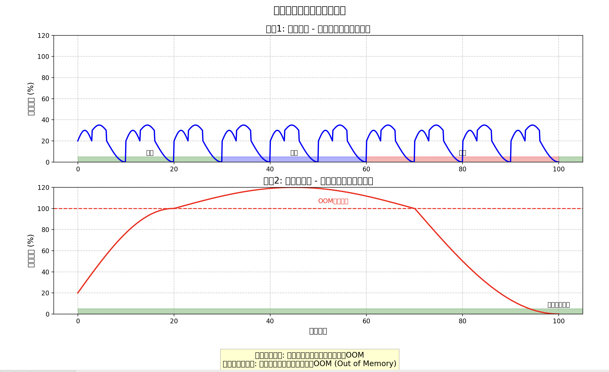
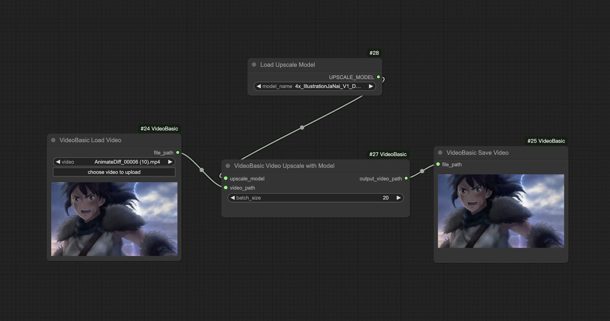

# ComfyUI VideoBasic

Used to solve the OOM (Out Of Memory) issue caused by loading all frames of a video at once in ComfyUI. All nodes use streamingly, and no longer load all frames of the video into memory at once.

todo:
    1. ~~Upscale~~
    2. Face Swap
    3. Latent Lip Sync

## Upscale

